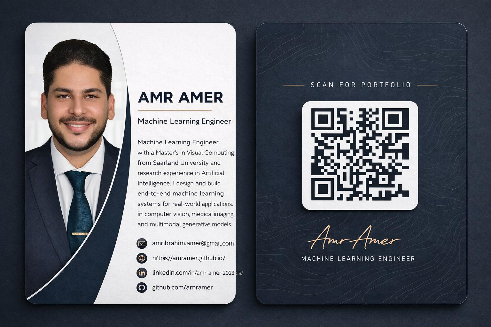

<!--
**amramer/amramer** is a ✨ _special_ ✨ repository because its `README.md` appears on your GitHub profile.
-->

<h1 align="center">Hi 👋, I'm Amr Amer</h1>
<h3 align="center">Machine Learning Engineer | Computer Vision | Multimodal Generative Models</h3>

  

  
  <a href="https://www.linkedin.com/in/amr-amer-2023-cs/">
    
  

---

## 🚀 Featured Projects

### 🎓 [Master’s Thesis: Personality-Aware Non-verbal Behavior Generation](https://github.com/amramer/Personality-Aware-Non-verbal-Behavior-Generation)
**Multimodal generative model** for generating realistic listener avatars in dyadic conversations, conditioned on personality traits.
  The model predicts facial expressions, head motion, and upper-body gestures of a listener from the speaker’s audio and motion signals.
  
  

      
  

  
- **Tech Stack:** PyTorch, Transformers, VQ-VAE, SMPL-X
- **Demo:** [Thesis Website](https://thesis-website-3sxt.onrender.com/)
- **Paper:** [Full Thesis Document](https://github.com/amramer/Personality-Aware-Non-verbal-Behavior-Generation/blob/main/docs/Thesis_final_doc.pdf)

---

### 🏸 [Badminton-VisionAI](https://github.com/amramer/Badminton-visionAI)
**End-to-end computer vision pipeline** for badminton match analysis: player/shuttle tracking, shot detection, mini-court projection, and coach-style performance reports.
- **Tech Stack:** OpenCV, YOLO, Streamlit, Plotly
- **Demo:** [Live Demo](https://badminton-visionai-web.onrender.com/) | [Pipeline Video](https://www.youtube.com/watch?v=dAe9e_1AGuA) | [Dashboard Video](https://www.youtube.com/watch?v=Bc2JLifgjzI)

---

### 🚗 [Semantic Segmentation for Autonomous Vehicles](https://github.com/amramer/Semantic-Segmentation-Model-for-Autonomous-Vehicles-An-End-to-End-ML-Workflow)
**End-to-end semantic segmentation** of urban street scenes using the BDD100K dataset.
- **Achievements:** mIoU ≈ 0.45, strong performance on road (0.88) and vehicle (0.78) classes
- **Tech Stack:** PyTorch, Fastai, Semantic Segmentation

---

### 🩺 [3D Brain Tumor Segmentation (MRI)](https://github.com/amramer/brain-tumor-segmentation-3D-DeepLearning)
**Multi-label 3D semantic segmentation** of glioma sub-regions from volumetric MRI scans.
- **Achievements:** Mean Dice = 0.78 on validation
- **Tech Stack:** PyTorch, MONAI, 3D SegResNet

---

### 🎙️ [AI Conversational Agent](https://github.com/amramer/AI-Conversational-Agent) (Ongoing)
**Conversational AI system** with real-time voice/text interaction, LLM-powered reasoning, and a human-like conversational avatar.
- **Tech Stack:** Python, OpenAI GPT, Speech-to-Text, Text-to-Speech, Gradio

---

### 🎥 [Realtime Vision Captioning](https://github.com/amramer/realtime-vision-captioning)
**Realtime image captioning** and visual question answering using BLIP and ResNet-50, deployed as a Gradio webcam application.
- **Tech Stack:** PyTorch, Hugging Face Transformers, Gradio

---

## 🌐 Portfolio
For more details about my work and projects, visit my [portfolio website](https://amramer.github.io/).

---

## 🧠 Technical Focus
 | Area                     | Skills & Tools                                                                 |
 |--------------------------|---------------------------------------------------------------------------------|
 | **Computer Vision**      | Object Detection, Segmentation, Tracking, Video Motion Analysis, Digital Avatars |
 | **Models & Frameworks**  | PyTorch, TensorFlow, OpenCV, YOLO, Vision Transformers (ViT), Supervision         |
 | **Training & Evaluation**| Transfer Learning, Hyperparameter Optimization, Weights & Biases, TensorBoard    |
 | **Deployment**           | Docker, AWS (EC2 GPU), Streamlit, Batch & Real-time Inference                    |
 | **Software Engineering** | Python, C++, Object-Oriented Design, Git, Debugging, Unit Testing                |

---

  

